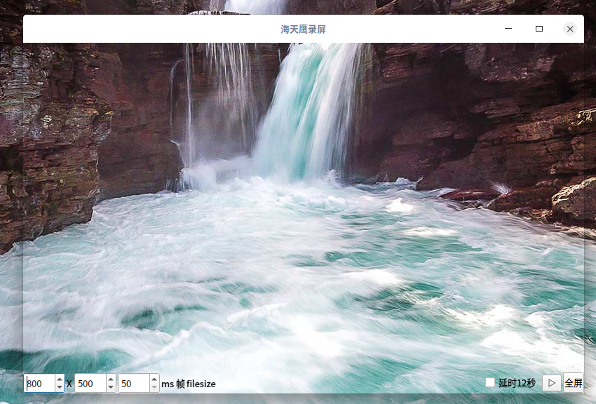

# 海天鹰录屏
Linux 平台基于 gif.h 的 GIF 录屏程序，利用透明窗体选择录制区域。  
已编译好的 HTYScreenRecorder 程序适用 64 位 Linux 系统 Qt5 环境，双击运行，其他版本请自行编译。
  
### 已知问题：
无法实现鼠标穿透
### 库：
https://github.com/ginsweater/gif-h
### 参考：
https://github.com/xiaoyanLG/Qt_Gif_Creator
